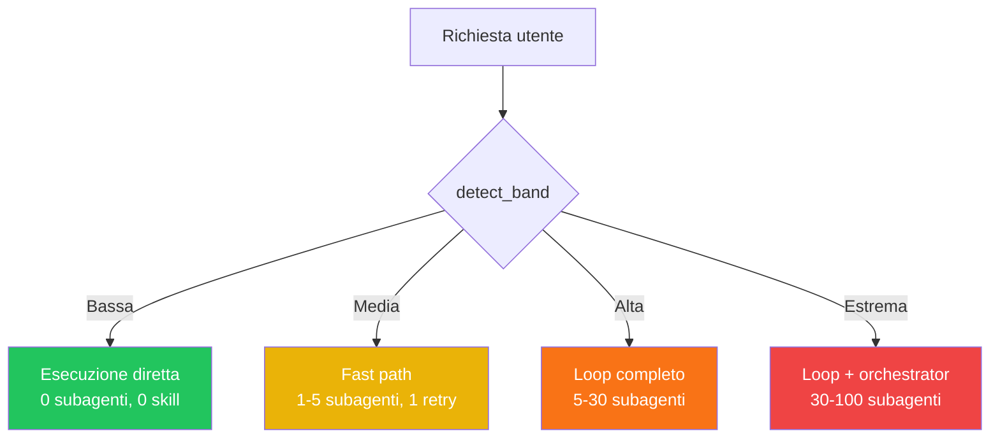

# 4-Band Filter — Primo Checkpoint

Il filtro che **PRIMA di tutto** categorizza la richiesta per decidere quanto della skill attivare.

## Le 4 Bande

| Banda | Esempi | Tier | Skill? | Subagenti | Loop? |
|-------|--------|------|--------|-----------|-------|
| **Bassa** | typo, fix, colore, rename | 1 | ❌ No | 0 | No |
| **Media** | endpoint, funzione, test, refactor | 2 | ✅ Sì | 1-5 | 1 iter |
| **Alta** | sistema, auth, API, multi-file | 3 | ✅ Sì | 5-30 | ∞ |
| **Estrema** | full-stack, e-commerce, MVP | 4 | ✅ Sì | 30-100 | ∞+orch |

## Risparmio Token

```
Bassa → NON caricare SKILL.md = ~8000 token risparmiati
Media → Carica, fast path
Alta/Estrema → Carica tutto, loop completo
```

## Implementazione

Script reale: `scripts/prometheus_engine.py` → `detect_band(prompt)`

```python
from prometheus_engine import detect_band
band = detect_band("correggi typo")  # → "bassa"
```

## Diagramma Flusso



## Collegamenti
- [[Tier System]] — Il band determina il tier iniziale
- [[Filosofia e Core Loop]] — Il loop si attiva solo per media+
- [[Configurazione]] — Script Python per enforcement
- [[Pitfalls]] — ❌ Over-engineering per task semplici
