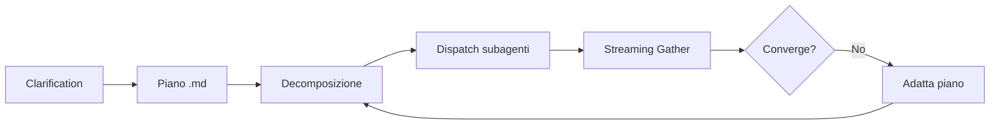

# Fase 0.5 — Plan Integration (Tier 3+)

Una fase di pianificazione strutturata PRIMA dello scatter riduce i retry del 30-40%.

## 0.5a — Clarification Interview

Prima di scrivere il piano, fai tutte le domande necessarie.

**Domande obbligatorie** (se l'info non è già presente):
- Architettura: monolite FastAPI o microservizi? DB?
- Scope: solo backend o anche frontend?
- Auth: JWT/session/OAuth?
- API esterne?
- Deploy target?
- Testing: suite completa o smoke test?
- Priorità: velocità o completezza?

**Regole:** max 5-6 domande, batch in unico messaggio, suggerisci default.

## 0.5b — Piano Strutturato

```
if tier >= 3:
    carica skill `plan`
    esplora codebase
    scrivi .hermes/plans/<timestamp>-<slug>.md
```

Il piano contiene:
- Architettura decisionale
- File inventory con path esatti
- Interface contracts preliminari
- Dipendenze tra task
- Test strategy

## Flusso Plan → Engine



## Collegamenti
- [[Fase 0 - Autonomous Loop Engine]] — Fase precedente
- [[Fase 1 - Massive Decomposition]] — Ogni task del piano → subagente
- [[Pitfalls]] — ❌ Saltare clarification interview (Tier 3+)
