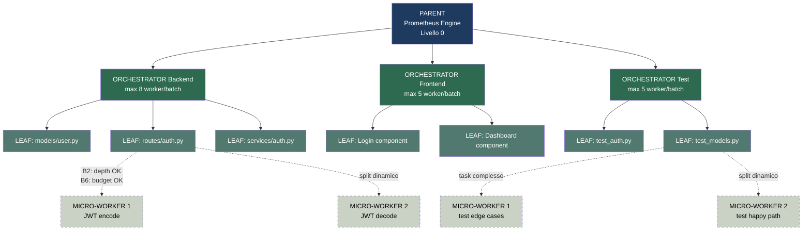
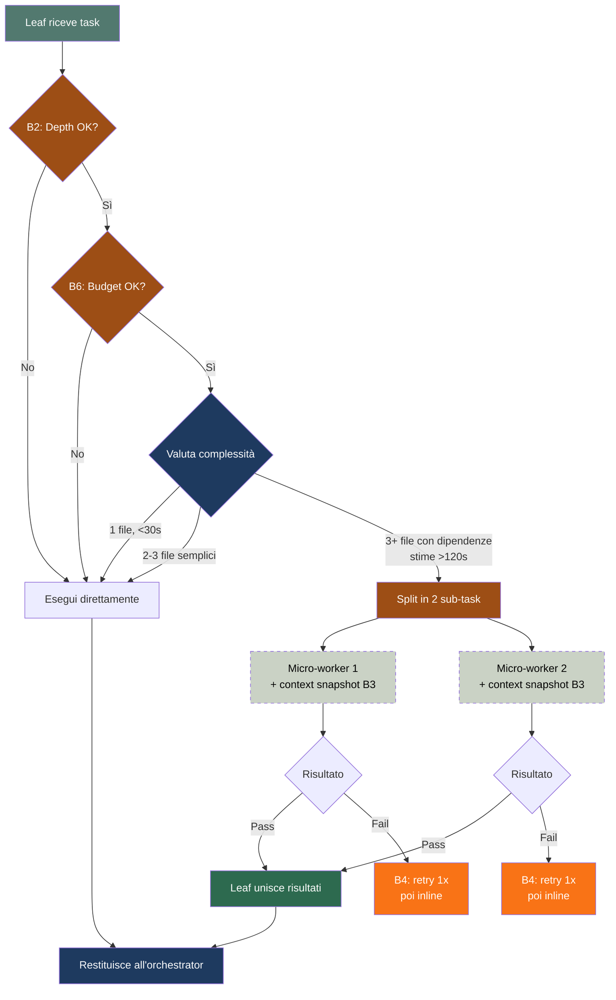

# Orchestrator Control — Controllo Sub-Agenti Dinamico

Gestione di orchestratori, leaf e micro-worker per task corposi. 6 regole anti-bottleneck integrate.

## Architettura a 4 Livelli



## 🛡️ 6 Regole Anti-Bottleneck

### B1 — Mini-Batch Streaming
Orchestrator dispatcha in **batch da 3-5 leaf**, non tutti insieme. Riduce la finestra di attesa se un leaf è lento.

### B2 — Depth Auto-Limit
La profondità massima dipende dal Tier, non è fissa:

| Tier | Familiarità | Depth max | Micro-worker? |
|------|-------------|-----------|---------------|
| 1-2 | qualsiasi | 0-1 | Mai |
| 3 | bassa | 2 | Mai |
| 3 | alta | 1 | Mai |
| 4 | bassa | 3 | Solo se >50 file |
| 4 | alta | 2 | Solo se 1 leaf anomalo |

### B3 — Context Injection Compatto
Ogni subagente riceve un **context snapshot < 200 token** con progetto, stack, convenzioni, goal globale.

### B4 — Retry Without Micro-Worker
Ogni retry **rimuove un livello di delega**:
- Tentativo 1: leaf + micro-worker
- Tentativo 2: leaf inline (0 micro-worker)
- Tentativo 3: orchestrator inline (0 leaf)

### B5 — Timeout Allineati
```bash
hermes config set delegation.child_timeout_seconds 300  # era 600
```

| Livello | Timeout | Margine |
|---------|---------|---------|
| Micro-worker | 60s | — |
| Leaf | 120s | 60s dopo micro |
| Orchestrator | 240s | 120s dopo leaf |
| Parent | 300s | 60s dopo orch |

Finestra morta: **0 secondi**.

### B6 — Context Budget Enforcement
Calcolo preventivo **OBBLIGATORIO** prima di dispatch. Se overflow:
1. Micro-worker → 0
2. Leaf: 8 → 5 per orchestrator
3. Orchestrator: 4 → 2
4. Tutto inline

## 🔄 Leaf Dynamic Split



### Guardrail Leaf Split
- MAX 2 micro-worker (hard limit)
- Micro-worker = dead-end
- B2: depth check per Tier
- B3: context snapshot < 200 token
- B4: degradazione forzata nei retry
- B5: timeout 60s → leaf inline
- B6: budget check prima di spawnare

## Configurazione

```bash
hermes config set delegation.max_spawn_depth 3    # 4 livelli
hermes config set delegation.max_concurrent_children 100
hermes config set delegation.child_timeout_seconds 300  # B5 allineato
```

## Pre-Dispatch Checklist

```
□ B1: Mini-batch da max 5 leaf?
□ B2: Depth appropriata per Tier?
□ B3: Context snapshot < 200 token?
□ B4: Strategia retry con degradazione?
□ B5: child_timeout = 300?
□ B6: can_dispatch() verificato?
□ Familiarità codebase valutata?
```

## Collegamenti
- [[Fase 2 - Autonomous Scatter]] — Dispatch base
- [[Fase 5 - Scale Patterns]] — Pattern per 100 subagenti
- [[Fase 3 - Streaming Quality Gate]] — Validazione
- [[Fase 7 - Failure Escalation]] — Error propagation
- [[Configurazione]] — max_spawn_depth=3, child_timeout=300
- [[Guardrail]] — I 10 guardrail self-learning
- [[Pitfalls]] — ❌ Context window overflow
