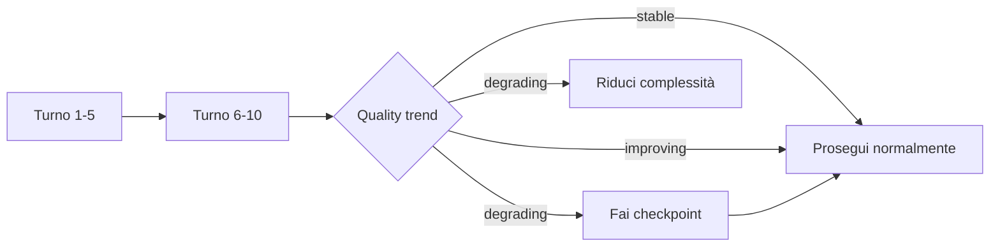

# Phase 11 — Long Session Management

Per sessioni di 2h+ con 30+ turni. 3 meccanismi che prevengono la degradazione della qualità.

## Il Problema

```
Turno 1-10:  qualità 8/10 ✅
Turno 11-20: qualità 7/10 ⚠️ (context al 50%)
Turno 21-30: qualità 5/10 ❌ (context 80%, compression death spiral)
```

## I 3 Meccanismi

### 1. Session State File

Lo stato della sessione viene salvato su disco (`~/.hermes/sessions/<id>.json`), non tenuto in context.

```python
from session_manager import SessionManager
sm = SessionManager("build_auth", "Implementa auth JWT")
sm.track_turn(action="creato modello User", files=["models.py"], score=8)
```

### 2. Checkpoint Automatico

Ogni 8 turni o 10 minuti, il checkpoint:
- Comprime i turni passati (solo ultimi 3 dettagliati in memoria)
- Produce un context summary di ~200 token
- Salva tutto su disco

### 3. Quality Trend Monitor



Confronta gli ultimi 5 punteggi con i precedenti 5. Se il calo > 15% → alert.

## Interrupt Recovery

Se la sessione si interrompe:

```python
sm = SessionManager("build_auth", "Implementa auth JWT")
recovery = sm.recover()
# → ti dice dov'eri rimasto, file modificati, decisioni prese
context = sm.get_context_summary()  # ~200 token
```

## Context Summary

Invece di 30 turni di cronologia, usi questo nel prompt:

```
=== SESSION STATE: build_auth ===
Goal: Implementa auth JWT
Turni: 20 | Qualità: 7.7/10 (stable)
File: models.py, routes.py, auth.py, ...
Decisioni: [5] Usare JWT refresh rotation
Ultimo checkpoint: turno 16
```

Risparmio: ~8.000 token di cronologia compressi in ~200.

## Collegamenti
- [[Fase 3 - Streaming Quality Gate]] — Quality check integrato col trend
- [[Fase 8 - Final Report]] — Report include metriche di sessione
- [[Fase 0 - Autonomous Loop Engine]] — State assessment considera quality trend
- `scripts/session_manager.py` — Implementazione reale
