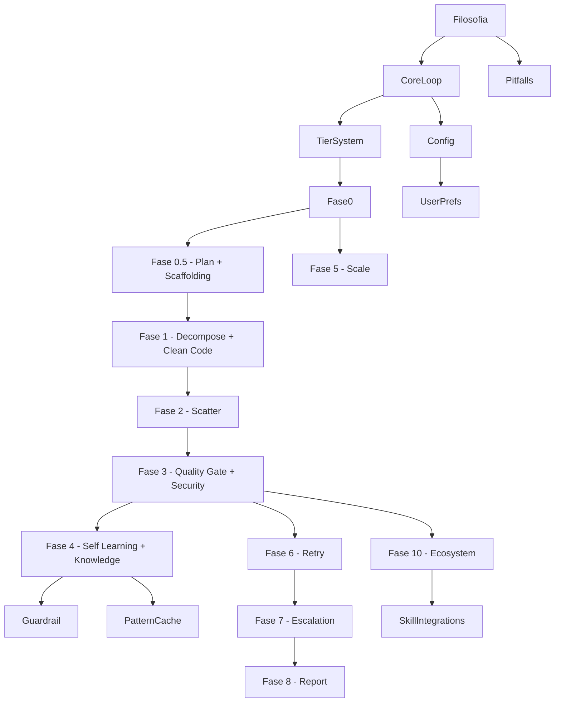

# 🏭 Prometheus Engine — Mappa delle Skill

Benvenuto nella knowledge base del **Prometheus Engine**, il loop agentico autonomo per coding mode.

## Mappa delle Connessioni

## Indice

### 🧠 Fondamenta
- [[4-Band Filter]] — Primo checkpoint: bassa/media/alta/estrema
- [[Filosofia e Core Loop]] — Philosophy, il loop `while goal_not_achieved`
- [[Tier System]] — Come calcolare il tier (1-4) e il Dynamic Subagent Allocation
- [[Configurazione]] — Prerequisiti, environment, hermes config
- [[Preferenze Utente]] — Template configurabile: lingua, commit, test, decimali
- [[Pitfalls]] — Tutti i fallimenti critici da evitare

### 🔄 Fasi del Loop
- [[Fase 0 - Autonomous Loop Engine]] — Initialize State → Assess → Decide
- [[Fase 0.5 - Plan Integration]] — Clarification interview + Piano + [[Phase 0.5c - Structural Alignment|Scaffolding Adattivo]]
- [[Fase 1 - Massive Decomposition]] — Decomposizione dinamica + [[Phase 1d-bis - Clean Code Standards|Clean Code Standards]]
- [[Fase 2 - Autonomous Scatter]] — Parallel dispatch + streaming
- [[Fase 3 - Streaming Quality Gate]] — Valutazione immediata + Execution + [[Phase 3d-ter - Security Shield AUTO|Security AUTO]]
- [[Fase 4 - Self-Learning Loop]] — 4 livelli: memory, pattern cache, skill, [[Phase 4g - Dynamic Knowledge Expansion|Dynamic Knowledge]]
- [[Fase 5 - Scale Patterns]] — 4 pattern per sfruttare 100 subagenti
- [[Fase 6 - Retry Intelligence]] — 4 tipi di retry + convergenza osservata + Actor-Critic
- [[Fase 7 - Failure Escalation]] — Ladder a 4 livelli
- [[Fase 8 - Final Report]] — Report strutturato + self-learning
- [[Fase 10 - Skill Ecosystem]] — Integrazione con altre skill Hermes
- [[Phase 11 - Long Session Management]] — 3 meccanismi per sessioni 2h+
- [[Orchestrator Control]] — Gerarchia 4 livelli per task corposi

### 🛡️ Self-Learning & Guardrail
- [[Guardrail]] — Gli 11 guardrail non-opzionali
- [[Guardrail 11 - Security Shield]] — AUTO (regex) + REVIEW (Actor-Critic)
- [[Pattern Cache]] — Token-efficient pattern storage
- [[Lesson Validation]] — Anti-circolarità
- [[Orchestrator Control]] — Gerarchia 4 livelli + B1-B6 anti-bottleneck
- [[Phase 4g - Dynamic Knowledge Expansion]] — Split Local/Global anti-overfitting

### 🏗️ Build & Code Quality
- [[Phase 0.5c - Structural Alignment]] — Scan First + Architettura proporzionata al Tier
- [[Phase 1d-bis - Clean Code Standards]] — Type Hints, SRP, DRY per Tier
- [[Phase 3d-ter - Security Shield AUTO]] — Regex check: secrets, SQL injection

### 🧪 Testing & Verifica
- [[E2E Integration Test]] — 35/35 checks su 4 scenari reali
- [[Quality Check]] — Enforcement automatico Phase 9 (include Security AUTO)
- `scripts/e2e_test.py` — `python e2e_test.py --verbose`
- `scripts/prometheus_engine.py` — `python prometheus_engine.py` (self-test)
- `scripts/100_benchmark.py` — 100 edge-case test per scovare falle

### 📚 Reference Patterns
- [[AI Response Caching]] — Cache SHA256 risposte AI (-92% latenza)
- [[Climatology 3 Levels]] — 3 livelli climatologici (esatto, ±5gg, mese)
- [[Ensemble Confidence Scoring]] — Blended 60/40 objective/subjective
- [[Int-to-Float Precision]] — Da int a 1 decimale per Polymarket betting
- [[External API Integration]] — Multi-fonte con flag e resilienza
- [[Ollama Integration]] — Chiamate Ollama con JSON robusto
- [[Weather API Integration]] — Pattern progetti meteo
- [[Benchmark Harness]] — Benchmark SQLite per skill Hermes
