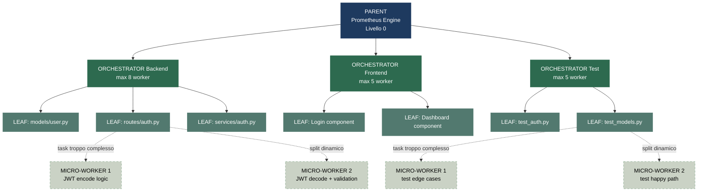
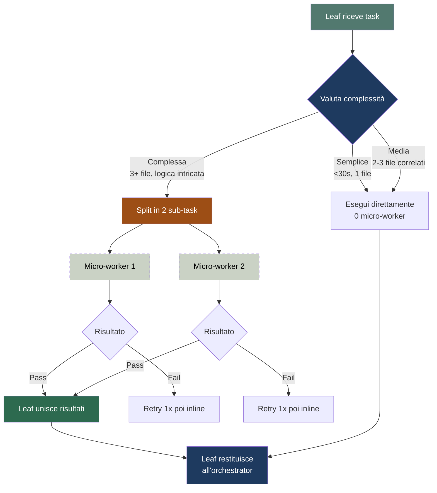

# Orchestrator Control — Sub-Agent & Multi-Level Delegation

## Architettura a 4 Livelli (Sistema Dinamico)

```
LIVELLO 0:  PARENT (io — Prometheus Engine)
           decide, decomponi, stream, valuta
              │
              ▼
LIVELLO 1:  ORCHESTRATOR (role='orchestrator')
           spawna worker specializzati, coordina output
              │
              ▼
LIVELLO 2:  LEAF (role='leaf' — worker operativo)
           esegue task atomico
           ⚠️ PUÒ spawnare max 2 micro-worker se il task è troppo complesso
              │
              ▼
LIVELLO 3:  MICRO-WORKER (role='leaf', max 2 per leaf)
           esegue sub-task split dal leaf parent
           NON può spawnare (dead-end)
```

### Diagramma Gerarchia



### Flusso Dinamico di Split



---

## 🛡️ Bottleneck Mitigations — 6 Regole Anti-Bottleneck

Queste regole risolvono i 6 bottleneck identificati nell'analisi strutturale.
Sono NON-OPZIONALI tanto quanto i Guardrail del self-learning.

### B1 — Mini-Batch Streaming per Orchestrator (risolve serializzazione)

**Problema:** `delegate_task` è bloccante — l'orchestrator aspetta TUTTI i leaf prima di tornare.
Se 1 leaf è lento (120s) e gli altri 4 finiscono in 20s, l'orchestrator aspetta 120s.

**Soluzione:** L'orchestrator dispatcha in **mini-batch da 3-5 leaf**, non tutti insieme.

```python
# ❌ BOTTLENECK: dispatch tutti insieme, aspetta tutti
delegate_task(tasks=[leaf_1, leaf_2, leaf_3, leaf_4, leaf_5,
                     leaf_6, leaf_7, leaf_8, leaf_9, leaf_10])

# ✅ MINI-BATCH: dispatch 3-5 alla volta, processa risultati tra i batch
# Batch 1: leaf 1-5 → attendi → processa → commit
# Batch 2: leaf 6-10 → attendi → processa → commit
# Se leaf_3 è lento, almeno leaf 1-2-4-5 sono già commitati
```

**Regola:** max 5 leaf per mini-batch. Se l'orchestrator ha 15 task → 3 mini-batch da 5.
Tra un batch e l'altro, l'orchestrator processa risultati, fa commit, e prepara il batch successivo.

**Esempio:**
```
Orchestrator con 12 task:
  Mini-batch 1: task 1-5  → attendi → 3 pass, 2 fail → commit 3, retry 2
  Mini-batch 2: task 6-10 → attendi → 4 pass, 1 fail → commit 4, retry 1
  Mini-batch 3: task 11-12 + 3 retry → attendi → 5 pass → commit 5
  TOTALE: 12/12 pass, 3 mini-batch invece di 1 batch grande
```

### B2 — Depth Auto-Limit (risolve costo token esponenziale)

**Problema:** Un task che attraversa 4 livelli costa 4.5× rispetto all'esecuzione diretta.

**Soluzione:** La profondità massima è determinata dal Tier, non impostata fissa.

```python
def max_depth_for_tier(tier, familiarity):
    # Familiarità alta riduce depth
    if familiarity == "alta":
        return 1  # parent → leaf, basta

    if tier <= 2:  return 1   # parent → leaf
    if tier == 3:  return 2   # parent → orchestrator → leaf
    if tier >= 4:  return 3   # parent → orch → leaf → micro-worker (SOLO >50 file)
```

**Tabella Depth Obbligatoria:**

| Tier | Familiarità | Depth max | Livelli attivi | Quando usare micro-worker |
|------|-------------|-----------|----------------|---------------------------|
| 1 | qualsiasi | 0 | Parent diretto | Mai |
| 2 | qualsiasi | 1 | Parent → Leaf | Mai |
| 3 | bassa | 2 | Parent → Orch → Leaf | Mai (solo se 1 leaf è anomalo) |
| 3 | alta | 1 | Parent → Leaf | Mai |
| 4 | bassa | 3 | Parent → Orch → Leaf → Micro | Solo se >50 file e 3+ layer |
| 4 | alta | 2 | Parent → Orch → Leaf | Solo se 1 leaf è anomalo |

**Regola d'oro:** Il 4° livello (micro-worker) è attivo SOLO per Tier 4 con codebase sconosciuto e >50 file. Per tutto il resto, max 2 livelli.

### B3 — Context Injection Compatto (risolve perdita di contesto)

**Problema:** Il micro-worker non sa nulla del progetto, stile, convenzioni.

**Soluzione:** Ogni livello inietta un **context snapshot compatto** (<200 token) al livello sottostante.

```
--- CONTEXT SNAPSHOT (iniettato in ogni subagente) ---
PROGETTO: {nome} | STACK: {tech_stack}
UTENTE: Boschi404 | LINGUA: italiano
CONVENZIONI: {1 riga di regole critiche}
GOAL GLOBALE: {1 riga di cosa stiamo costruendo}
TUO RUOLO: {orchestrator|leaf|micro-worker}
TUO TASK: {descrizione specifica}
--- FINE SNAPSHOT ---
```

**Esempio reale (<150 token):**
```
PROGETTO: PolimarketWeather | STACK: FastAPI+React+Ollama
UTENTE: Boschi404 | LINGUA: italiano
CONVENZIONI: temperature float 1 decimale, commit+push dopo ogni task
GOAL: modulo autenticazione JWT per API meteo
TUO RUOLO: micro-worker
TUO TASK: implementa register() e login() con JWT encode in routes/auth.py
```

**Regola:** il context snapshot è SEMPRE < 200 token. Se non riesci a stare in 200 token, il task è troppo complesso anche per un micro-worker → non splittare.

### B4 — Retry Without Micro-Worker (risolve retry amplification)

**Problema:** Se un leaf fallisce dopo aver spawnato 2 micro-worker, il retry spawnerebbe di nuovo, raddoppiando i costi.

**Soluzione:** Regola di degradazione forzata nei retry.

```
TENTATIVO 1: leaf + micro-worker (se serve)       → costo normale
TENTATIVO 2 (retry): leaf implementa INLINE        → 0 micro-worker
TENTATIVO 3 (last): orchestrator implementa inline  → 0 leaf, 0 micro-worker
ESCALATION: parent implementa inline o scala utente
```

**Regola:** ogni retry rimuove un livello di delega. MAI ri-spawnare micro-worker nello stesso retry. MAI ri-spawnare leaf nello stesso retry dopo 2 fallimenti.

```python
def retry_strategy(attempt, original_used_micro_worker):
    if attempt == 1:
        return "retry_with_feedback"  # stesso approccio + feedback
    if attempt == 2:
        return "inline"  # 0 micro-worker, leaf fa tutto
    if attempt == 3:
        return "orchestrator_inline"  # 0 leaf, orchestrator fa tutto
    return "escalate"
```

### B5 — Timeout Allineati (risolve timeout conflict)

**Problema:** `child_timeout_seconds=600` è più lungo di tutti i livelli combinati (240s). Finestra morta di 360s.

**Soluzione:** Timeout a cascata con margini minimi e allineamento al config globale.

```bash
hermes config set delegation.child_timeout_seconds 300  # 5 min (era 600)
```

**Tabella Timeout Allineata:**

| Livello | Timeout | Margine | Se timeouta → |
|---------|---------|---------|---------------|
| Micro-worker | 60s | — | Leaf completa inline |
| Leaf (senza micro) | 90s | 30s dopo micro | Orchestrator retry (batch piccolo) |
| Leaf (con micro) | 120s | 60s dopo micro | Orchestrator retry → inline (B4) |
| Orchestrator | 240s | 120s dopo leaf | Parent completa inline |
| Parent (child_timeout) | 300s | 60s dopo orch | Escalation utente |

**Regola:** il timeout del parent (300s) è esattamente 60s dopo il timeout dell'orchestrator (240s). Nessuna finestra morta. Se l'orchestrator timeouta a 240s, il parent ha 60s per intervenire prima che Hermes killi tutto.

### B6 — Context Budget Enforcement (risolve overflow silenzioso)

**Problema:** Il context budget è definito ma non c'è un meccanismo di enforcement. L'overflow è silenzioso.

**Soluzione:** Calcolo preventivo OBBLIGATORIO prima di ogni dispatch.

```python
def can_dispatch(num_orchestrators, leafs_per_orch, micro_per_leaf_ratio=0.3):
    """Verifica se il batch rientra nel context budget. Ritorna True/False."""
    # Stima token
    orch_summary = num_orchestrators * 1500
    leaf_summary = num_orchestrators * leafs_per_orch * 500
    micro_summary = int(leaf_summary * micro_per_leaf_ratio * 0.6)  # 30% leaf hanno micro, 2 summary da 300
    total = orch_summary + leaf_summary + micro_summary

    # Budget: 40% del context rimanente
    # Assumendo context_length 128K, conversation ~20K, system ~10K
    available = 40000  # stima conservativa
    budget = available * 0.4  # 16K

    if total > budget:
        return False, f"OVERFLOW: {total} > {budget}. Riduci leaf o orchestrator."
    return True, f"OK: {total}/{budget} token ({total/budget*100:.0f}%)"
```

**Regola di fallback se OVERFLOW:**

```
SE OVERFLOW:
  1. Prima riduzione: micro-worker a 0 (nessun leaf splitta)
  2. Se ancora overflow: riduci leaf per orchestrator (da 8 a 5)
  3. Se ancora overflow: riduci orchestrator (da 4 a 2)
  4. Se ancora overflow: esegui TUTTO inline (0 delegazione)
```

**Mai** dispatchare oltre il budget. L'overflow silenzioso causa compression death spiral.

---

## Quando Usare un Orchestrator

| Scenario | Subagenti diretti | Usa orchestrator? |
|----------|------------------|-------------------|
| 1-5 task indipendenti, stessa area | 1-5 leaf | ❌ No, dispatch diretto |
| 10+ task su 3+ sotto-sistemi diversi | 10+ leaf | ✅ Sì, 1 orchestrator per sotto-sistema (mini-batch da 5) |
| Task che richiede ricerca + implementazione | 1 leaf | ✅ Sì, orchestrator coordina ricerca → implementazione |
| Sistema full-stack (>50 file, 3+ layer) | 30+ leaf | ✅ Sì, orchestrator per layer (con depth=3, micro-worker attivi) |
| Benchmark multi-condizione | 5-10 leaf | ✅ Sì, orchestrator coordina baseline/v1/v2 |
| Codebase conosciuto (familiarità alta) | — | ❌ No, esecuzione diretta (B2) |

**Regola pratica:** se hai più di 10 task oppure task su 3+ aree distinte, usa orchestrator. MA se conosci il codebase, 0 subagenti.

## 🔄 Leaf Dynamic Split — Quando un Worker si Splitta

### Regola Fondamentale

Un leaf (role='leaf') che riceve un task e **valuta che è troppo complesso per essere completato da solo** può spawnare **MASSIMO 2 micro-worker** per completarlo.

### Criteri di Split (quando il leaf decide di spawnare)

```
IL LEAF DEVE SPAWNARE SE (TUTTE e 2 le condizioni):
  ├─ Il task richiede 3+ file con logica interdipendente
  └─ La stima di completamento > 120 secondi

IL LEAF NON DEVE SPAWNARE SE:
  ├─ Il task è 1 file singolo → fai direttamente
  ├─ Il task è 2 file semplici → fai direttamente
  ├─ Lo split non ha senso logico (dipendenza circolare)
  ├─ Hai già provato e fallito → implementa inline (B4)
  ├─ Depth max per Tier non lo permette (B2)
  └─ Context budget non lo permette (B6)
```

### Come il Leaf Splitta

```python
def leaf_should_split(task, tier, familiarity, context_budget_ok):
    # B2: depth check
    max_depth = max_depth_for_tier(tier, familiarity)
    if max_depth < 3:
        return False, "Depth non permessa per questo Tier"

    # B6: budget check
    if not context_budget_ok:
        return False, "Context budget insufficiente"

    # Criteri operativi
    files_needed = count_files(task)
    has_interdeps = check_interdependencies(task)
    estimated_time = estimate_complexity(task)

    if files_needed >= 3 and has_interdeps and estimated_time > 120:
        return True, split_strategy(task)
    return False, None
```

### Leaf Split Prompt Template

Il leaf che decide di splittare deve:

```
--- CONTEXT SNAPSHOT (B3) ---
PROGETTO: {nome} | STACK: {tech_stack}
UTENTE: Boschi404 | LINGUA: italiano
CONVENZIONI: {1 riga di regole critiche}
GOAL GLOBALE: {1 riga}
TUO RUOLO: micro-worker
TUO TASK: {sub-task specifico}
--- FINE SNAPSHOT ---

TASK ORIGINALE: {task_description}
VALUTAZIONE: Questo task richiede {N} file con dipendenze — troppo complesso per 1 worker.

SPLIT IN 2 SUB-TASK:
  Sub-task A: {descrizione sub-task A} — file: {file_list_A}
  Sub-task B: {descrizione sub-task B} — file: {file_list_B}

CONTRATTO INTERFACCIA TRA A E B:
  {funzione_condivisa(firma_esatta)}

SPAWN 2 MICRO-WORKER (role='leaf', max 2):
  delegate_task(tasks=[
    {"goal": sub_task_A, "context": "<context_snapshot + sub-task A>", "role": "leaf"},
    {"goal": sub_task_B, "context": "<context_snapshot + sub-task B>", "role": "leaf"},
  ])

UNISCI RISULTATI:
  - Verifica coerenza tra A e B (interface contract rispettato?)
  - Se un micro-worker fallisce: retry max 1 volta, poi implementa inline (B4)
  - Restituisci risultato aggregato all'orchestrator
```

### Configurazione Necessaria

```bash
# Per supportare 4 livelli: Parent(0) → Orchestrator(1) → Leaf(2) → Micro-worker(3)
hermes config set delegation.max_spawn_depth 3    # era 2 → ora 3
hermes config set delegation.max_concurrent_children 100  # invariato (tetto globale)
hermes config set delegation.child_timeout_seconds 300    # B5: allineato (era 600)
```

**⚠️ Importante:** max_spawn_depth=3 significa:
- Livello 0 (Parent) → può spawnare Livello 1
- Livello 1 (Orchestrator) → può spawnare Livello 2
- Livello 2 (Leaf) → può spawnare Livello 3 (micro-worker, MAX 2)
- Livello 3 (Micro-worker) → NON può spawnare (dead-end)

### Esempio Reale di Leaf Split

```
ORCHESTRATOR BACKEND dispatcha:
  → LEAF: "Implementa routes/auth.py con register, login, refresh, logout"

LEAF valuta (con B2, B6):
  - Tier 4, codebase sconosciuto → depth 3 permesso ✓
  - Context budget OK ✓
  - 4 endpoint, 1 file ma logica complessa (JWT encode + decode + validation)
  - Stimato: 180s (soglia 120s superata)
  - DECIDE DI SPLITTARE

LEAF spawna 2 micro-worker (con context snapshot B3):
  → MICRO-WORKER 1: "Implementa register() + login() con JWT encode"
    Context: PROGETTO PolimarketWeather | FastAPI+React | italiano | float 1 decimale | modulo auth JWT | micro-worker | sub-task: register+login
  → MICRO-WORKER 2: "Implementa refresh() + logout() con JWT decode + validation"
    Context: [stesso snapshot + sub-task: refresh+logout]

CONTRATTO:
  encode_token(user_id: int) -> str  [sincrona, in micro-worker 1]
  decode_token(token: str) -> dict   [sincrona, in micro-worker 2]

MICRO-WORKER 1: 45s → score 8/10 ✅
MICRO-WORKER 2: 60s → score 7/10 ✅

LEAF unisce: routes/auth.py completo, 4 endpoint, score 8/10
LEAF restituisce all'orchestrator: ✅ pass
```

## Come Configurare un Orchestrator

```python
delegate_task(
    goal="Implementa il modulo di autenticazione",
    role="orchestrator",     # ← può spawnare sub-agenti
    context={
        "max_children": 5,    # quanti worker può spawnare per mini-batch (B1)
        "quality_threshold": 7,
        "child_timeout": 240, # B5: allineato
        "subagent_auto_approve": True,
    }
)
```

### Cosa DEVE ricevere l'orchestrator nel context

```
--- CONTEXT SNAPSHOT (B3) ---
PROGETTO: {nome} | STACK: {tech_stack}
UTENTE: Boschi404 | LINGUA: italiano
CONVENZIONI: {regole critiche}
GOAL GLOBALE: {goal}
TUO RUOLO: orchestrator
--- FINE SNAPSHOT ---

--- SOTTO-SISTEMI DA COORDINARE ---
1. models/user.py — Modello User (id, email, password_hash, created_at)
2. routes/auth.py — Endpoint register/login/refresh/logout
3. services/auth.py — JWT encode/decode, password hashing, validation
4. tests/test_auth.py — Test per ogni endpoint

--- CONTRATTI INTERFACCIA ---
register(email: str, password: str) -> TokenResponse
login(email: str, password: str) -> TokenResponse
verify_token(token: str) -> UserPayload

--- REGOLE ANTI-BOTTLENECK ---
- Mini-batch da max 5 leaf (B1)
- Retry: degrada a inline dopo 1 fallimento (B4)
- Micro-worker SOLO se depth permesso (B2)
```

## Orchestrator Prompt Template

Ogni orchestrator spedito deve ricevere un prompt che spiega COME coordinare:

```
TASK: {description}
YOUR ROLE: ORCHESTRATOR — sei il coordinatore

PUOI:
- spawnare fino a {max_children} worker per mini-batch (B1)
- ogni worker è un LEAF (può a sua volta spawnare max 2 micro-worker se B2 lo permette)
- raccogliere i risultati e validarli

DEVI:
1. Analizzare il task in sotto-task atomici
2. Dispatchare in mini-batch da max 5 (B1)
3. Processare risultati tra un batch e l'altro (commit, retry)
4. Validare ogni risultato (quality >= {threshold}/10)
5. Se un worker fallisce: retry 1x con feedback, poi inline (B4)
6. Iniettare context snapshot compatto in ogni worker (B3)
7. Restituire il risultato aggregato

NON DEVI:
- Spawnare più di {max_children} worker per batch
- Chiedere chiarimenti all'utente (non puoi)
- Delegare ad altri orchestrator (max_spawn_depth limitato)
- Ri-spawnare micro-worker nei retry (B4)

RETURN FORMAT:
## RESULT
- status: pass|fail|partial
- quality_score: N/10
- worker_results: [{nome, status, score, files_creati, micro_worker_spawned: bool, batch_n: N}]
- gaps: [cosa manca se non pass]
- bottleneck_check: {context_budget_ok: bool, depth_used: N, max_depth: N}
```

## Monitoring dei Sub-Agenti

### Tracciamento Live

Il parent mantiene uno stato centrale per TUTTI i sub-agenti:

```python
SUBAGENT_STATE = {
    "orchestrator_auth": {
        "role": "orchestrator",
        "status": "in_flight",
        "batch_n": 2,               # B1: mini-batch tracking
        "workers_spawned": 8,
        "workers_completed": 5,
        "workers_failed": 0,
        "elapsed_seconds": 45,
        "context_used": 8500,        # B6: context tracking
        "context_budget": 16000,
    },
    "leaf_model_user": {
        "role": "leaf",
        "status": "completed",
        "quality_score": 8,
        "elapsed_seconds": 12,
        "micro_workers_spawned": 0,
        "retry_count": 0,            # B4: retry tracking
    },
    "leaf_routes_auth": {
        "role": "leaf",
        "status": "in_flight",
        "quality_score": None,
        "elapsed_seconds": 30,
        "micro_workers_spawned": 2,  # LEAF HA SPLITTATO
        "micro_workers_status": ["completed", "in_flight"],
        "retry_count": 0,
    },
}
```

### Heartbeat & Timeout (B5 allineati)

| Tipo | Timeout | Azione su timeout |
|------|---------|-------------------|
| Micro-worker | 60s | Leaf implementa inline il sub-task (B4) |
| Leaf (senza micro) | 90s | Orchestrator retry (mini-batch piccolo) |
| Leaf (con micro) | 120s | Orchestrator retry → inline (B4) |
| Orchestrator | 240s | Parent kill + completa inline |
| Parent (child_timeout) | 300s | Escalation utente con stato documentato |

### Timeout Strategy a Cascata (B5)

```
EACH LEVEL HAS 2× THE TIMEOUT OF THE LEVEL BELOW, WITH 60s MARGIN:

  Micro-worker:  60s  (dead-end, non può spawnare)
       ↑
  Leaf:         120s  (può spawnare micro-worker, gestisce timeout interno)
       ↑
  Orchestrator: 240s  (gestisce timeout dei leaf, mini-batch B1)
       ↑
  Parent:       300s  (60s di margine dopo orchestrator timeout)

  FINestra morta: 0s (300 - 240 = 60s di margine controllato)

  Se micro-worker timeouta:
    → Leaf ritenta 1 volta, poi implementa inline (B4)

  Se leaf timeouta (anche con micro-worker):
    → Orchestrator ritenta 1x con hint, poi implementa inline (B4)

  Se orchestrator timeouta:
    → Parent prende worker completati, completa gap inline

  Se parent timeouta:
    → Escalazione utente con stato + metriche documentate
```

## Context Budget Multi-Livello (B6)

### Regole Context per Ogni Livello

```
CONTEXT BUDGET PER LIVELLO (con enforcement B6):
  ├─ Parent → Orchestrator:     summary orchestrator  < 1500 token
  ├─ Orchestrator → Leaf:       context leaf          < 2000 token
  ├─ Leaf → Micro-worker:       context micro-worker  < 1000 token
  │                              (incluso context snapshot B3 < 200 token)
  └─ Micro-worker → Leaf:       summary micro-worker  < 300 token

BUDGET GLOBALE:
  Parent conserva 60% per sé.
  40% distribuito tra orchestrator → leaf → micro-worker.

ENFORCEMENT (B6): calcolo preventivo OBBLIGATORIO prima di dispatch.

SE OVERFLOW (ordine di riduzione):
  1. Micro-worker → 0 (nessun leaf splitta)
  2. Leaf per orchestrator: 8 → 5
  3. Orchestrator: 4 → 2
  4. Tutto inline (0 delegazione)
```

### Esempio Calcolo con Enforcement

```python
# can_dispatch() verifica PRIMA di dispatchare
ok, msg = can_dispatch(num_orchestrators=3, leafs_per_orch=5, micro_per_leaf_ratio=0.3)
# 3 × 1500 + 15 × 500 + 3 × 600 = 4,500 + 7,500 + 1,800 = 13,800
# Budget: 16,000 → 13,800/16,000 = 86% ✓

# Se provo con 5 orchestrator × 10 leaf:
ok, msg = can_dispatch(num_orchestrators=5, leafs_per_orch=10, micro_per_leaf_ratio=0.3)
# 5×1500 + 50×500 + 15×600 = 7,500 + 25,000 + 9,000 = 41,500
# Budget: 16,000 → 41,500/16,000 = 259% → OVERFLOW!
# → Applica riduzione: 3 orchestrator × 5 leaf, 0 micro-worker
# 3×1500 + 15×500 + 0 = 12,000 → 75% ✓
```

## Error Propagation Multi-Livello (con B4)

```
┌─ Micro-worker fallisce (score < threshold)
│   └── Leaf rileva il fallimento
│       ├─ PRIMO TENTATIVO: retry micro-worker con feedback (max 1)
│       ├─ SE FALLISCE: implementa sub-task INLINE (B4: degradazione forzata)
│       └─ Continua con l'altro micro-worker
│
┌─ Leaf fallisce (anche dopo micro-worker)
├── Orchestrator rileva il fallimento
│   ├─ PRIMO TENTATIVO: retry con feedback (0 micro-worker, B4)
│   ├─ SE FALLISCE: orchestrator implementa INLINE (B4: degradazione)
│   │   ├─ Segna worker come "partial" con gaps documentati
│   │   ├─ Prosegue con gli altri worker (mini-batch B1)
│   │   └─ Nel risultato finale: gaps[] + worker_results[]
│
├── Parent (io) riceve risultato orchestrator
│   ├─ Legge gaps[] e worker_results[] e bottleneck_check
│   ├─ Decide se:
│   │   ├─ Accettare partial (score >= threshold - 1)
│   │   ├─ Ritentare orchestrator con hint più specifici
│   │   └─ Implementare inline i gap
│   └─ Aggiorna stato
│
└── Se orchestrator NON torna (timeout B5):
    ├─ Parent prende i worker già completati
    ├─ Completa i worker mancanti DIRECT (inline, come Tier 1)
    └─ Salva lezione: "Orchestrator per task X è timeoutato"
```

## Pattern: Tier-4 Orchestrator Cascade con Leaf Split

Per task enormi (50+ file, codebase sconosciuto):

```
LIVELLO 0: PROMETHEUS ENGINE (io)
  ├─ 1 orchestrator BACKEND (max 8 worker per mini-batch)
  ├─ 1 orchestrator FRONTEND (max 5 worker per mini-batch)
  ├─ 1 orchestrator TEST (max 5 worker per mini-batch)
  └─ 1 orchestrator DOCS/DEV-OPS (max 3 worker per mini-batch)

  B6 check: 4×1500 + 21×500 + 6×300 = 6,000 + 10,500 + 1,800 = 18,300
  Budget 16,000 → OVERFLOW (114%)
  → Riduzione: 0 micro-worker (B6 step 1)
  → 4×1500 + 21×500 = 16,500 → 103% → ancora overflow
  → Riduci leaf: 4×1500 + 16×500 = 14,000 → 87% ✓ (16 leaf totali, 4 per orch)

LIVELLO 1: ORCHESTRATOR BACKEND (mini-batch B1)
  Mini-batch 1: 4 leaf (models + 1 route)
  Mini-batch 2: 4 leaf (routes)
  Mini-batch 3: 4 leaf (services)
  → 12 leaf totali, max 4 per batch

LIVELLO 2: LEAF routes/auth.py
  B2 check: Tier 4, codebase sconosciuto → depth 3 permesso
  B6 check: context budget per questo leaf OK
  Task complesso → SPLITTARE
  ├─ micro-worker 1: JWT encode + register + login
  └─ micro-worker 2: JWT decode + refresh + logout

LIVELLO 3: (micro-worker, dead-end, non spawna)
```

**Regola:** max_spawn_depth=3 permette Parent→Orch→Leaf→Micro. Micro-worker NON può spawnare.

## Guardrail per Leaf Split

```
LEAF SPLIT GUARDRAILS:
  ├─ MAX 2 micro-worker per leaf (HARD LIMIT)
  ├─ Micro-worker NON può spawnare (dead-end)
  ├─ B2: depth max determinata dal Tier, non fissa
  ├─ B3: context snapshot < 200 token iniettato in ogni micro-worker
  ├─ B4: se entrambi i micro-worker falliscono → leaf implementa inline
  ├─ B4: MAI ri-spawnare micro-worker nello stesso retry
  ├─ B5: micro-worker timeout 60s → leaf completa inline
  ├─ B6: context budget check prima di spawnare micro-worker
  ├─ Leaf DEVE unire i risultati prima di restituirli all'orchestrator
  ├─ Leaf DEVE verificare che i micro-worker rispettino l'interface contract
  └─ Se il leaf non può splittare logicamente → non splittare (mai forzare)
```

## Bottleneck Checklist Pre-Dispatch

```
PRIMA di dispatchare qualsiasi batch con orchestrator:

□ B1: Mini-batch da max 5 leaf per orchestrator?
□ B2: Depth appropriata per il Tier? (T1-2: 1, T3: 2, T4: 3)
□ B3: Context snapshot preparato (< 200 token per subagente)?
□ B4: Strategia retry definita? (degradazione inline dopo 1 fail)
□ B5: child_timeout_seconds = 300? (allineato con cascade)
□ B6: can_dispatch() verificato? (token < budget 40%)
□ Se B6 overflow: applicata riduzione (micro→0, leaf→5, orch→2)?
□ Familiarità codebase valutata? (se alta, 0 subagenti)
```

## Collegamenti
- [[Fase 2 - Autonomous Scatter]] — Dispatch base senza orchestrator
- [[Fase 5 - Scale Patterns]] — Pattern per 100 subagenti
- [[Fase 3 - Streaming Quality Gate]] — Validazione risultati
- [[Fase 7 - Failure Escalation]] — Error propagation ladder
- [[Configurazione]] — max_spawn_depth=3, child_timeout=300
- [[Guardrail]] — I 10 guardrail del self-learning
- [[Pitfalls]] — ❌ Context window overflow, ❌ Subagenti su codebase familiare
